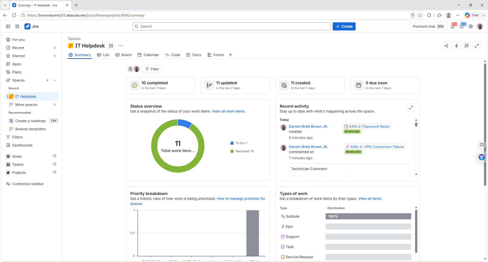
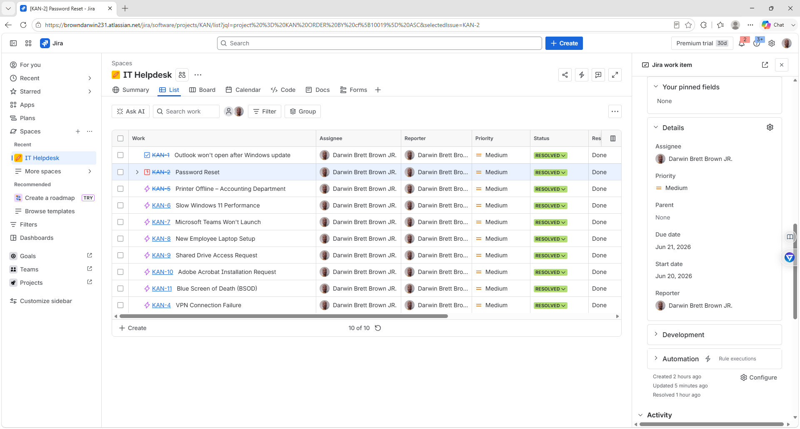
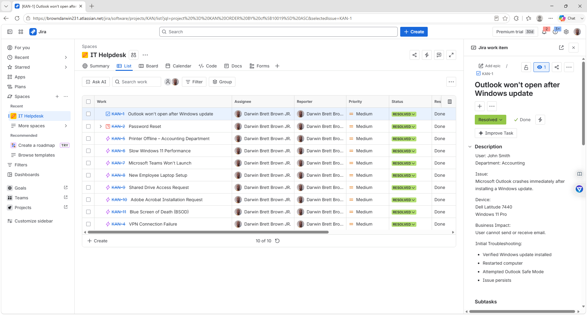
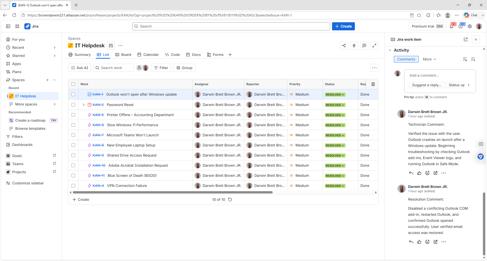
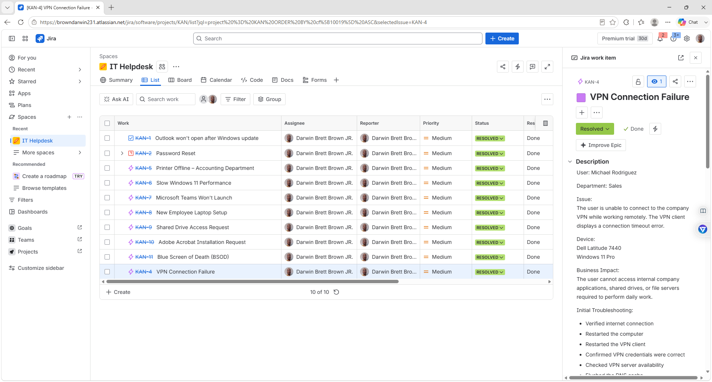
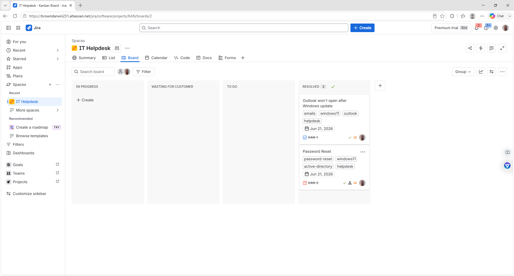

# Darwin Jira IT Help Desk Ticketing Lab

## Overview

This project demonstrates hands-on experience using Jira to manage IT Help Desk incidents from creation through resolution. It simulates a real-world Service Desk environment by documenting common IT support requests, troubleshooting steps, technician notes, and ticket closures.

The goal of this lab is to showcase practical IT support skills, ticket lifecycle management, and professional documentation using Jira.

---

## Skills Demonstrated

- Jira Service Management
- Incident Management
- Ticket Lifecycle Management
- IT Help Desk Documentation
- Troubleshooting Methodology
- Customer Support
- Windows 11 Support
- Microsoft 365 Administration
- VPN Troubleshooting
- Printer Troubleshooting
- Password Resets
- Laptop Deployment
- Remote IT Support
- Technical Documentation

---

## Ticket Scenarios

This project includes realistic IT support tickets such as:

- Outlook won't open after Windows update
- Password Reset Request
- VPN Connection Failure
- Printer Offline – Accounting Department
- Slow Windows 11 Performance
- Microsoft Teams Won't Launch
- New Employee Laptop Setup
- Shared Drive Access Request
- Adobe Acrobat Installation Request
- Blue Screen of Death (BSOD)

Each ticket includes:

- User information
- Device details
- Business impact
- Initial troubleshooting
- Technician comments
- Resolution comments
- Final ticket closure

---

# Project Workflow

1. User reports an issue.
2. Incident ticket is created.
3. Issue priority is assigned.
4. Initial troubleshooting is performed.
5. Technician investigates the problem.
6. Resolution is documented.
7. User confirms the fix.
8. Ticket is closed.

---

# Screenshots

06-labtop-setup-ticket.png

07-board-ticket.png.png

---

# Tools Used

- Jira Software
- Windows 11
- Microsoft 365
- Microsoft Outlook
- Microsoft Teams

---

# What I Learned

- Managing incidents using Jira
- Tracking tickets through their lifecycle
- Writing clear technician documentation
- Recording troubleshooting steps
- Documenting issue resolutions
- Prioritizing incidents based on business impact
- Organizing IT support work using a Kanban board

---

# Author

**Darwin Brett Brown Jr.**
